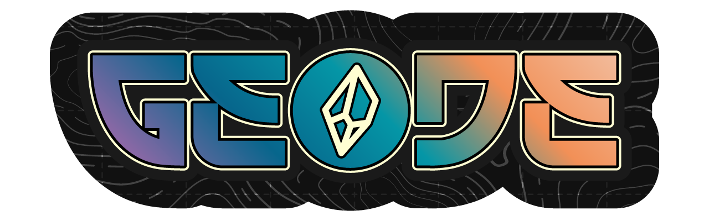

<p align="center">
  
</p>

<p align="center">
  <strong>Codebase intelligence that runs on your machine. Architecture map, agent-ready skill file, and scored gap report — without sending a line of source code to anyone's cloud.</strong>
</p>

<p align="center">
  Built for the cases hosted documentation tools can't reach: HIPAA-grade scrubbing, a tamper-evident audit trail, and the AI provider of your choice. The <code>skill-file.geodesic.json</code> it produces is a brain transplant for Cursor, Claude Code, Antigravity, and any agent that needs real context about your repo.
</p>

<p align="center">
  <a href="https://github.com/direwulfco/geodesic/actions/workflows/ci.yml"></a>
  <a href="LICENSE"></a>
  <a href="https://marketplace.visualstudio.com/items?itemName=direwulfco.geodesic-topo"></a>
  <a href="https://open-vsx.org/extension/direwulfco/geodesic-topo"></a>
</p>

---

<p align="center">
  
</p>

---

## What hosted tools can't do

| What you need | Why hosted services can't deliver | How Geodesic answers |
|---|---|---|
| **Code stays on-prem** | Cloud-hosted documentation tools upload your repo to a third party | Engine runs locally. No uploads, no SaaS data residency questions, no BAA negotiation |
| **HIPAA / regulated industries** | No general-purpose cloud SaaS will sign a BAA for arbitrary source code | PHI/PII intercept layer + tamper-evident attestation chain ship with every scan |
| **Multi-provider freedom** | Single-vendor tools lock you to one AI | Anthropic, OpenAI, Gemini, Azure, or local Ollama — one config flag |
| **Agent-readable output** | Wiki tools produce docs for humans to scroll | The skill file is machine-consumable context built for Cursor, Claude Code, Copilot, and any agent operating on your codebase |

---

## Three artifacts, every run

Written to `<your-repo>/geodesic-findings/` (auto-gitignored):

### Architecture Map — full topology
Layers, APIs, databases, auth patterns, infrastructure.

<p align="center">
  
</p>

### Skill File — context your agent can actually use
Machine-readable (`skill-file.geodesic.json`) and human-readable (`skill-file.geodesic.md`). Stop pasting files into Claude.

<p align="center">
  
</p>

### Gap Report — scored, prioritized, exact
Seven dimensions. P0–P3 findings with `file:line` references.

<p align="center">
  
</p>

---

## How it works

```
Repository
    │
    ▼
Static Harvester        — files, routes, databases, auth, deps, tests, infra
    │
    ▼
PII/HIPAA Intercept     — scrubs every string value, replaces with typed tokens
    │                     tamper-evident attestation chain written per detection
    ▼
Crystal Query           — checks your Crystal Store for a matching prior analysis
    │                     ~70% token reduction on cache hit
    ▼
AI Synthesis            — provider-agnostic, sees scrubbed data only
    │                     5-minute timeout, exponential backoff on rate limits
    ▼
Artifact Generator      — three output files, written atomically
    │
    ▼
Crystal Extractor       — updates your Crystal Store with structural patterns
                          zero source code, zero PII in crystals — ever
```

---

## Why Geodesic is different

- **Local-first.** The engine runs on your machine. Code never leaves your environment.
- **HIPAA-safe by default.** A mandatory PII intercept layer scrubs every string value before any AI call. The AI never sees a raw value.
- **Tamper-evident attestation chain.** Every scrubbed value is logged in a SHA-256-linked `.jsonl` your compliance team can audit.
- **Bring your own AI.** Anthropic, OpenAI, Gemini, Azure OpenAI, or fully local with Ollama. One config flag.
- **Crystal Store.** Compounding intelligence stored in a private GitHub repo *you own*. We never see it. Cache hits cut token cost ~70%.
- **Cross-editor.** One engine powers VS Code, Cursor, Antigravity, VSCodium, JetBrains IDEs, and the terminal.

---

## Crystal Store

A learning system that accumulates structural patterns across analyses. It lives in **your own GitHub repository** — Geodesic reads and writes it directly. We never see it, touch it, or host it.

```bash
# Point Geodesic at your own repo
geodesic config set crystal-store-repo https://github.com/your-org/your-crystals
geodesic config set crystal-store-token ghp_your_token

# First run clones it automatically
geodesic crystals sync
```

Crystals contain zero source code and zero PII — only structural fingerprints and reasoning patterns. Teams running Geodesic across multiple projects see compounding quality improvements as the store grows.

---

## Installation

### VS Code, Cursor, Antigravity, VSCodium

Install directly from the [VS Code Marketplace](https://marketplace.visualstudio.com/items?itemName=direwulfco.geodesic-topo) or [Open VSX Registry](https://open-vsx.org/extension/direwulfco/geodesic-topo).

Or install from VSIX:
```bash
code --install-extension geodesic-topo-1.1.0.vsix
```

The VSIX is self-contained — the analysis engine is bundled. No separate install required.

### JetBrains (IntelliJ, WebStorm, PyCharm, GoLand, Rider)

JetBrains plugin — **coming soon.** [Join the waitlist](https://github.com/direwulfco/geodesic/issues/new?title=JetBrains+waitlist).

### CLI

```bash
npm install -g @geodesic/cli
```

---

## Quickstart (CLI)

```bash
# 1. Set your AI provider
geodesic config set provider anthropic
geodesic config set api-key sk-ant-…

# 2. Analyze a repository
geodesic analyze /path/to/your/repo

# 3. View results
open /path/to/your/repo/geodesic-findings/gap-report.md
```

---

## Supported AI providers

| Provider | Notes |
|---|---|
| Anthropic (Claude) | Recommended — best gap report quality |
| OpenAI (GPT-4o) | Fully supported |
| Google Gemini | Fully supported |
| Azure OpenAI | Enterprise deployments |
| Ollama | Air-gapped — no API key, no network calls |

Geodesic is provider-agnostic by design. Swap providers with a single config change.

---

## PHI/HIPAA compliance

- Every string value in the harvested payload is inspected before AI synthesis
- Detections are replaced with typed, reversible tokens — the AI never sees the original value
- A tamper-evident, SHA-256-linked attestation chain is written for every scrubbed value
- Uncertain detections (confidence < HIGH) are scrubbed and flagged for manual review
- The attestation chain (`geodesic-attestation.jsonl`) is a compliance deliverable — never committed to git, never synced

---

## Monorepo structure

```
packages/
├── engine/        TypeScript — all analysis logic, local REST daemon
├── vscode-ext/    VS Code extension (.vsix) — thin shell over the engine API
├── jetbrains/     JetBrains plugin — thin shell over the engine API
└── cli/           CLI wrapper — geodesic analyze
```

---

## Building from source

```bash
# Install dependencies
npm install

# Build all packages
npm run build --workspaces

# Run tests
npx vitest run

# Type check
npm run typecheck --workspaces

# Build VS Code extension
cd packages/vscode-ext
node esbuild.mjs --production
npx vsce package --no-dependencies
```

---

## Requirements

- Node.js 18 LTS or higher
- An API key for your chosen provider (or Ollama running locally)

---

## License

MIT — see [LICENSE](LICENSE)

---

> Geodesic is currently listed on the VS Code Marketplace and Open VSX as **Geodesic Topo** while we wait for Microsoft to release the reserved `Geodesic` name. Same extension, same publisher (`direwulfco`), same code.

---

*Built by [Dire Wulf](https://github.com/direwulfco).*
