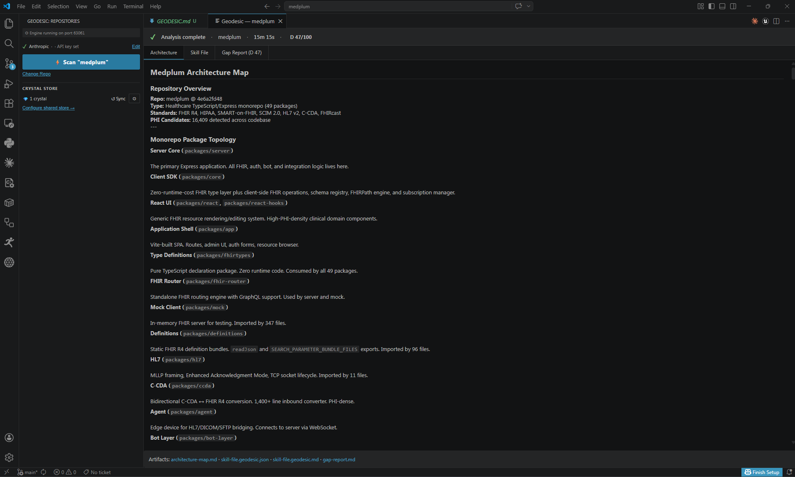
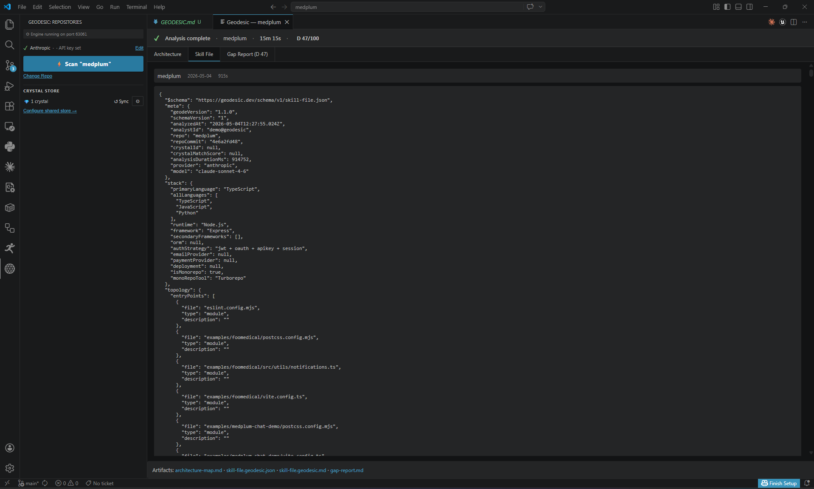
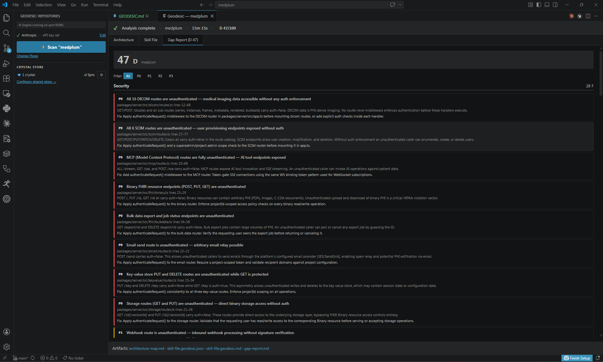

# Geodesic

**Codebase intelligence that runs on your machine. Architecture map, agent-ready skill file, and scored gap report — without sending a line of source code to anyone's cloud.**

Built for the cases hosted documentation tools can't reach: HIPAA-grade scrubbing, a tamper-evident audit trail, and the AI provider of your choice. The `skill-file.geodesic.json` it produces is a brain transplant for Cursor, Claude Code, Antigravity, and any agent that needs real context about your repo.

---

## What you get

Three artifacts, written to `<your-repo>/geodesic-findings/` (auto-gitignored):

### Architecture Map
Full topology — layers, APIs, databases, auth patterns, infrastructure.

### Skill File
Machine-readable context package your AI agent can load directly. Stop pasting files into Claude.

### Gap Report
Scored across 7 dimensions. P0–P3 findings with exact `file:line` references.

---

## Why Geodesic is different

- **Local-first.** The engine runs on your machine. Your code never leaves your environment.
- **HIPAA-safe by default.** A mandatory PII intercept layer scrubs every string value before any AI call. Detections are replaced with typed tokens. The AI never sees a raw value.
- **Tamper-evident attestation chain.** Every scrubbed value is logged in a SHA-256-linked `.jsonl` file your compliance team can audit.
- **Bring your own AI.** Anthropic, OpenAI, Gemini, Azure OpenAI, or fully local with Ollama. One config flag.
- **Crystal Store.** Geodesic learns across analyses via structural fingerprints stored in a private GitHub repo *you own*. We never see it. Cache hits cut token cost ~70%.
- **Cross-editor.** One install runs on VS Code, Cursor, Antigravity, VSCodium, and any VS Code-compatible editor.

---

## Quickstart

1. **Install** from the VS Code Marketplace (you're here) or Open VSX Registry.
2. **Open the Geodesic sidebar** (activity bar) and configure your AI provider. Settings save to `~/.geodesic/config.json` and stay on your machine.
3. **Add a repository** or let Geodesic auto-detect your current workspace.
4. **Click Analyze.** Progress streams live in the sidebar. Results open automatically when complete.

---

## Supported AI providers

| Provider | Notes |
|---|---|
| Anthropic (Claude) | Recommended — best gap report quality |
| OpenAI (GPT-4o) | Fully supported |
| Google Gemini | Fully supported |
| Azure OpenAI | Enterprise deployments |
| Ollama | Air-gapped — no API key, no network calls |

---

## Privacy

Geodesic's PII/HIPAA intercept layer runs locally before any data leaves your machine. The AI sees only scrubbed, tokenized payloads. The attestation chain (`geodesic-attestation.jsonl`) is written to your home directory and is never uploaded, synced, or included in Crystal exports.

---

## Requirements

- VS Code 1.85.0 or higher (Cursor, Antigravity, VSCodium also supported)
- Node.js 18 LTS or higher (engine bundled — no separate install)
- An API key for your chosen provider, or Ollama running locally

---

## Resources

- **Source:** [github.com/direwulfco/geodesic](https://github.com/direwulfco/geodesic)
- **Issues:** [github.com/direwulfco/geodesic/issues](https://github.com/direwulfco/geodesic/issues)
- **License:** MIT

---

*Built by [Dire Wulf](https://github.com/direwulfco).*
